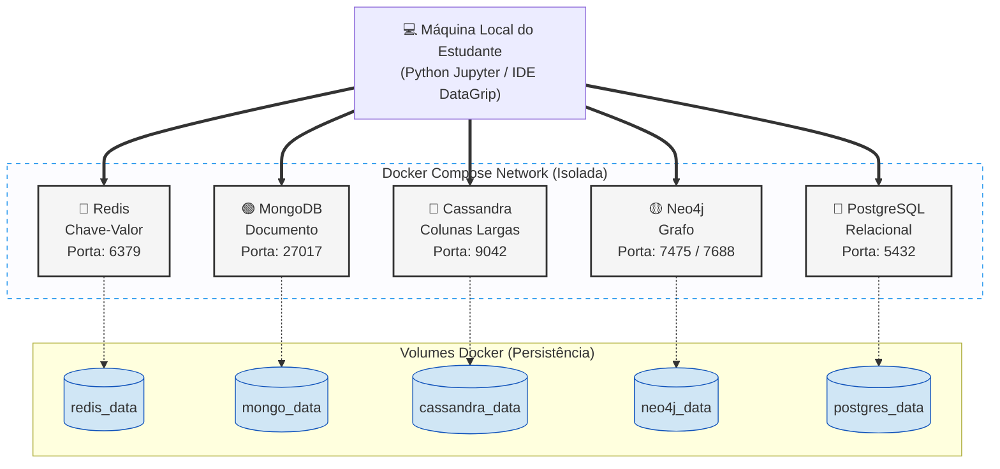

# 🧪 Database Laboratory: SQL and NoSQL

### **The Practical Guide to Modern Data Scale and Persistence**

Experiment the five main database paradigms on the market running simultaneously on your local machine, with well-grounded theory and iterative code.


---

## 🎯 What is this repository?

A **hands-on laboratory** to explore the data revolution. Over the last decades, we have moved from the absolute reign of the Relational model to the architectural diversity of the NoSQL movement. Here, you will experience both:

- 📖 **Rich Documentation** — Theory based on solid foundations (ACID, CAP Theorem, and Access Patterns).
- ⚙️ **Universal Test Environment** — Spin up a cluster with the 5 main databases with a single command.
- 💻 **Interactive Guides (Labs)** — Interact for real using Python and Jupyter Notebooks.

> **Target audience:** Students, data scientists, and engineers who want to master modern data persistence, understanding the reasoning behind each architectural choice.

---

## ⚡ Quick Start (5 minutes)

If you already have Docker, `make`, and `uv` installed, you can start the lab in three simple steps:

```bash
# 1. Clone the repository
git clone https://github.com/hiltonmbr/cdn-nosql-lab.git
cd cdn-nosql-lab

# 2. Start the Database infrastructure (runs in background)
make up

# 3. Set up the Python virtual environment and start the Labs
make setup-env
make jupyter-lab
```

Your browser will open automatically with the interactive exercise notebooks in the `notebooks/` folder. Choose `.venv` as the Python kernel in the first notebook.

> **⚠️ Note about Cassandra:** Cassandra's startup is intensive on the system. It may take 1 to 2 minutes for it to be ready to accept connections after `make up`.

---

## ⚙️ Prerequisites

To run the labs, ensure your machine meets the following requirements:

| Requirement         | Details                                                                                                                                              |
| ------------------- | ---------------------------------------------------------------------------------------------------------------------------------------------------- |
| **Docker Engine**   | Essential to instantiate databases in isolation ([Installation](https://docs.docker.com/get-docker/))                                                |
| **Docker Compose**  | Already bundled with Docker Desktop (orchestrates our 5 services)                                                                                    |
| **Make (optional)** | Used for terminal shortcuts. If you don't have it, use raw Docker commands.                                                                          |
| **Python 3.8+**     | Recommended for running notebooks in a Python virtual environment.                                                                                   |
| **uv**              | Fast Python package installer and resolver. Essential for `make setup-env`. Install with `curl -LsSf https://astral.sh/uv/install.sh | sh` or see [official docs](https://docs.astral.sh/uv/getting-started/installation/) |
| **Resources**       | 8GB RAM or more is recommended.                                                                                                                      |

Verify the installation of the vital tools:

```bash
docker version
docker compose version
uv --version
```

---

## 🗺️ Learning Map

To get the most out of the lab, we suggest the following journey: first the theoretical foundation, then the guided immersion in the terminal/notebook for each paradigm.

### 📖 Theory: Foundations of Scale

|  #  | Theoretical Module                          | What you'll learn                                                                       |                  Link                  |
| :-: | :------------------------------------------ | :-------------------------------------------------------------------------------------- | :------------------------------------: |
|  1  | **The Scale Challenge and the CAP Theorem** | The relational limit, ACID guarantee, and the Theorem that governs distributed systems. | [📖 Read](docs/01-sql-vs-nosql-cap.md) |
|  2  | **NoSQL Paradigms and Data Models**         | How storage differs: Table, Hash, Document, Wide Column, and Graph.                     | [📖 Read](docs/02-nosql-paradigms.md)  |

### 🧪 Practical Labs: Hands On

Our labs take place inside the `notebooks/` folder. Follow the order or jump straight to the database of your interest:

|  #  | Database          | Paradigm    | Real Use Cases                                                                                 |               Interactive Lab                |
| :-: | :---------------- | :---------- | :--------------------------------------------------------------------------------------------- | :------------------------------------------: |
|  1  | 🔴 **Redis**      | Key-Value   | Caches, web sessions, abandoned carts, real-time leaderboards.                                 |   [🧪 Go to Lab](notebooks/01_redis.ipynb)   |
|  2  | 🟢 **MongoDB**    | Document    | Flexible e-commerce catalogs, CMS, agile prototyping, multi-faceted profiles.                  |  [🧪 Go to Lab](notebooks/02_mongodb.ipynb)  |
|  3  | 🔵 **Cassandra**  | Wide-Column | Massive writes: industrial IoT sensors, time-series metrics, continuous log streams.           | [🧪 Go to Lab](notebooks/03_cassandra.ipynb) |
|  4  | 🟡 **Neo4j**      | Graph       | Social networks (friend-of-a-friend), product recommendation, optimal routes, fraud detection. |   [🧪 Go to Lab](notebooks/04_neo4j.ipynb)   |
|  5  | 🐘 **PostgreSQL** | Relational  | Rigorous financial systems, payroll, where 100% consistency is vital.                          | [🧪 Go to Lab](notebooks/05_postgres.ipynb)  |

> [!NOTE]
> You can also explore graphs visually. When the lab is running, access the **[Neo4j Browser](http://localhost:7475)** panel and enter `bolt://localhost:7688` to interactively explore edges!

---

## 🏗️ Lab Architecture

Below is the architecture of the database fleet running through Docker Compose, using isolated networks and guaranteed persistence via volumes.



---

## 📝 Lab Administration Cheatsheet

Besides the notebooks, you can "enter" the databases via command line to make short queries. Use the tools already configured in the `Makefile`:

```bash
# ── Lab Orchestration ──
make up            # Starts the entire lab in background
make down          # Pauses the lab (but does not delete your data)
make clean         # ⚠️ DESTROYS containers AND wipes all data (useful to start over)
make status        # See which databases are running

# ── Accessing Native Terminals ──
make shell-redis       # Opens the Redis CLI (redis-cli)
make shell-mongo       # Opens the MongoDB Shell (mongosh)
make shell-cassandra   # Opens the Query CLI (cqlsh)
make shell-postgres    # Opens the Postgres CLI (psql)
```

---

## 💾 Data Persistence and Cleanup

Your experimentation is safe. The project uses **named Docker volumes**.

This means that if you turn off your computer (or run `make down`), the tables, documents, and graphs created inside the notebooks will be preserved the next time you start the containers.

If you've made a mess and want to "reset" all databases to their clean initial state, just run `make clean`.

---

## 📄 Official References and License

- [MongoDB University](https://learn.mongodb.com/)
- [Neo4j GraphAcademy](https://graphacademy.neo4j.com/)
- [DataStax Cassandra](https://www.datastax.com/learn)

> **Open educational material.** Created for the practical lessons of the **Data Science for Business** course (UFPB). Developed by Hilton Martins.
